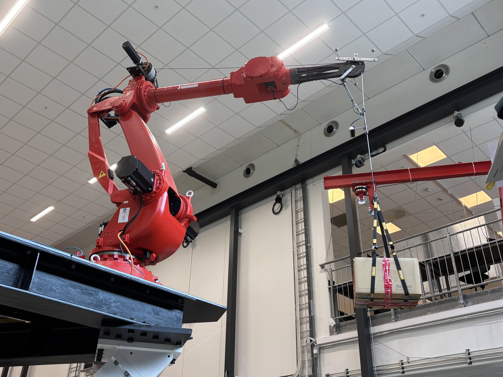
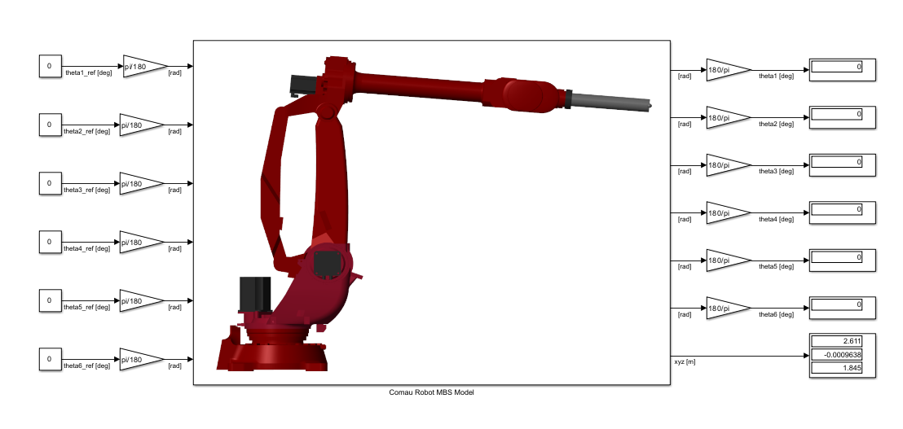

# Comau Robot MBS Simulink Simulator

This repo includes the MATLAB-Simulink MBS Simulator model of the Comau Robot located in the Norwegian Motion Laboratory ([UiA Motion Lab](https://www.uia.no/motionlab)).

 

The Simulator is currently a work in progress and was initially developed during the Mechatronics MSc thesis "Development and Validation of a Simulator of the Norwegian Motion Laboratory" at the University of Agder by Thomas Eikeland in 2024 using MATLAB R2024b together with Simulink, and Simscape Multibody.

To start the Simulator, first run the Datafile.m file including the MBS model parameters, and then open the ComauRobotMbsModel.slx file.

 
